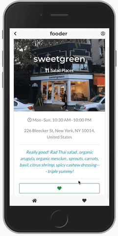

# Fooder

Fooder is mobile friendly and allows users to connect with others who are interested in restaurants they want to go to. Restaurants have chat threads for users who liked the venue and to coordinate plans to go together.

View demo: https://fooder-app-frontend.herokuapp.com

## Quick Demo

## Chat Demo

# Stack

Fooder is built using the following:

- React JS
- Ruby on Rails
- Twitter Bootstrap
- Font Awesome
- Foursquare API
- ActionCable
- Redux
